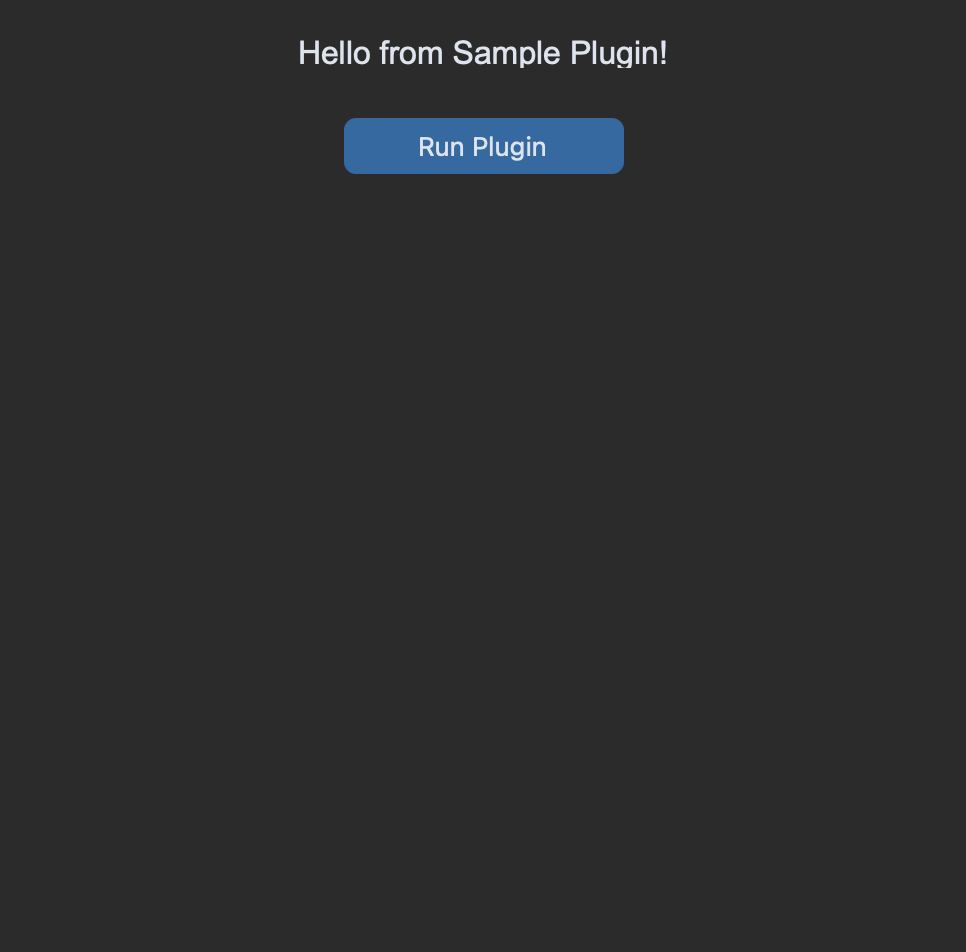

# Plugin 1

## Description
Plugin 1 is a tool that helps you do XYZ.

## Installation
1. Download the plugin files.
2. Place them in your plugins directory.

## Usage
python import plugin1
plugin1.do_something()

## Screenshots
